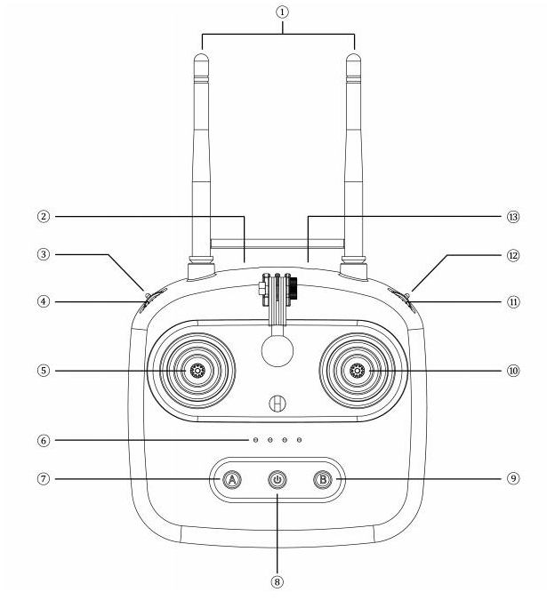

# Система управления Батраком с помощью Пульта управления Skydroid T10 с ресивером Skydroid R10

## Схема управления

Включение и выключение пульта управление производится по нажатию и удержанию кнопки питания (8 пункт на схеме пульта)

Крутилка F (11 пункт на схеме пульта) управляет уровнем газа.

Кнопка А (7 пункт на схеме пульта) имеет два режима при нажатии включается и выключается подсветка вокруг кнопки.

Управление при **отсутствии подсветки** кнопки А 

| Кнопка / Ось | Направление / Нажато | действие | Условие |  Пункт на картинке |
| ------ | ------ | ------ | ------ | ------ |
| X1 | налево | Поворот налево | Если кнопка А не нажата (не горит) | 5 |
| X1 | направо | Поворот налево | Если кнопка А не нажата (не горит) | 5 |
| Y1 | вниз | Мотор вперед | Если кнопка А не нажата (не горит) | 5 |
| Y1 | вверх | Мотор вперед | Если кнопка А не нажата (не горит) | 5 |
| Y2 | вниз | Стрела вниз | Если кнопка А не нажата (не горит) | 10 |
| Y2 | вверх | Стрела вверх | Если кнопка А не нажата (не горит) | 10 |

Управление при **присутствии подсветки** кнопки А 

| Кнопка / Ось | Направление / Нажато | действие | Условие |  Пункт на картинке |
| ------ | ------ | ------ | ------ | ------ |
| X2 | направо | Запуск стартера | Если кнопка А нажата (горит) | 10 |
